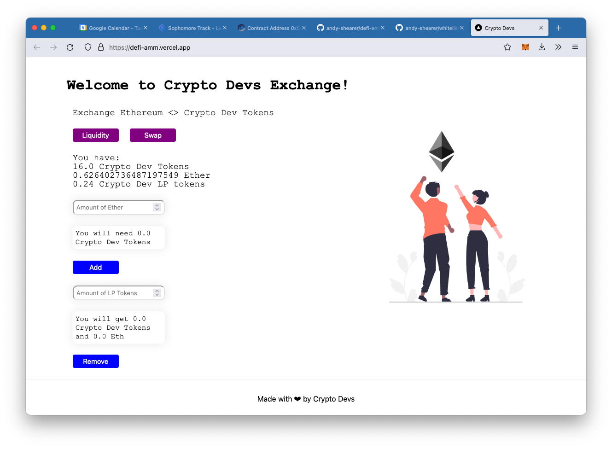

# Decentralised Finance - Automated Market Maker Project (DeFi-AMM)

This project is focusing on building a decentralized finance (DeFi) exchange using the Equito cross-chain protocol. It allows owners of the CryptoDevs token to provide liquidity for an ETH <> CD Token swap.

## Features
- **Liquidity Provision**: Users can add liquidity to the pool for ETH and CryptoDevs (CD) tokens. Liquidity providers are issued ERC-20 Liquidity Pool tokens, which represent their share of the pool.
- **Initial Swap Ratio**: If no liquidity exists, liquidity providers can set the initial swap ratio between ETH and CD tokens.
- **Liquidity Pool Tokens**: Liquidity providers receive LP tokens, which can be redeemed at any time to withdraw their ETH and CD tokens from the liquidity pool.

## Technologies
- **Smart Contracts**: Developed using the Equito cross-chain protocol and deployed using Hardhat.
- **Frontend**: Built with Next.js for a smooth and responsive user experience.
- **Cross-Chain Support**: Deployed on Equito, enabling cross-chain asset swaps and liquidity provision.

## Project Structure
- **Hardhat**: Smart contract development and deployment tools. See the [README](./hardhat/README.md) for more details.
- **Next.js**: Frontend interface for interacting with the DeFi exchange. See the [README](./my-app/README.md) for more details.

## Deployed Project
The project is live at: [https://defi-amm.vercel.app/](https://defi-amm.vercel.app/)

